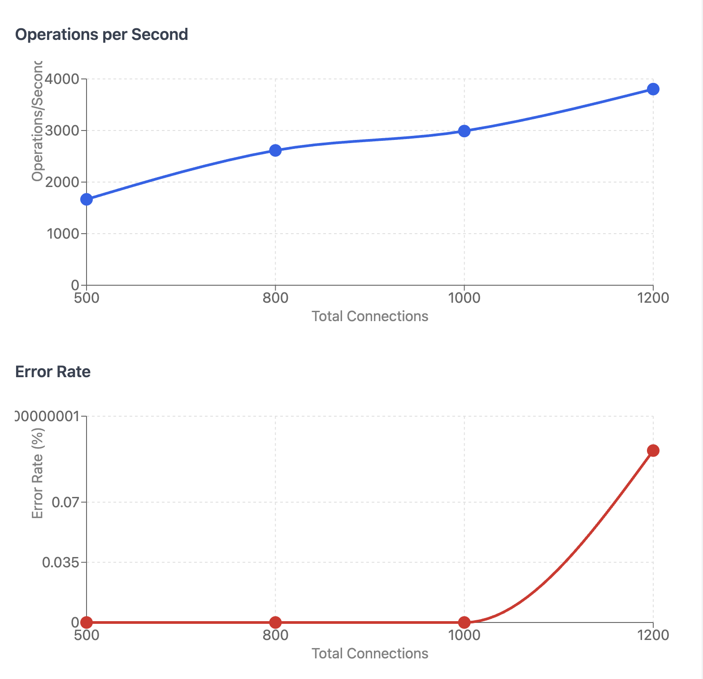

# toy-redis

This is a simple in-memory key value store built in Go. It is designed to be a minimal implementation of a Redis-like server for educational purposes.

## Supported Operations

- `SET key value` - Set the value of a key
- `GET key` - Get the value of a key

## 🏃 Running the Server

To run the server, you need to have Go installed on your machine. Clone the repository and run the following command:

```bash
go run server/*.go
```

Or use docker compose

```
docker compose build
docker compose up
```

To run the client, make sure `netcat` is installed on your machine. You can use the following command to connect to the server:

```bash
nc localhost 6379
```

## Concurrency

This is built on top of TCP. Every connection spawns a go routine to handle the request. This means that multiple clients can connect to the server at the same time and send requests concurrently.
At first I used map to store the key-value pairs, but it is not safe for concurrent access, I got concurrent map access error.

Then I used mutex to synchronize access to the map, but it was not efficient. Because I used `sync.Mutex` for both GET and SET operations. It meant that both GET and SET operations would block each other. Finally I used `sync.RWMutex` to allow multiple readers to access the map at the same time, while still allowing only one writer to access it.

### Load test results

I ran the server on t3.medium machine in EC2 with 2 vCPUs and 4GB of RAM. I used the `load_test_runner` script to setup TCP client and test a sustained load of varying concurrent connections. Below are the results:

```
==== Sustained load test result ====
Total Operations performed: 99921
Total connections: 500
Total errors: 0
Error rate: 0.00%
Ops per second: 1665.35

==== Sustained load test result ====
Total Operations performed: 156819
Total connections: 800
Total errors: 0
Error rate: 0.00%
Ops per second: 2613.65

==== Sustained load test result ====
Total Operations performed: 179370
Total connections: 1000
Total errors: 1
Error rate: 0.00%
Ops per second: 2989.50

==== Sustained load test result ====
Total Operations performed: 228166
Total connections: 1200
Total errors: 232
Error rate: 0.10%
Ops per second: 3802.77
```

Here is the visualization of the results:


So clearly it can support 1000 concurrent connections with around 3k ops per second while keeping the error rate very low. The error rate increases with the number of connections.

### Further Optimizations

1. Move read write mutex to `sync.Map` because it has no locks for reading the map which will improves performance for read heavy workloads.
2. On t3.medium machine, I went with default "ulimit" i.e. file descriptor limit, thus allowing only 1k concurrent connections. This can be configured to a higher number unlocking greater concurrency. Each port can communicate to client using multiple sockets. Usually there is one socket for each client connection, so number of concurrent clients are limited by number of sockets a machine can create. Each socket is essentially a file, thus number of sockets are dependent upon number of file descriptors a system can support. And `ulimit` helps us configure a higher number of file descriptor. But each increment in number of file descriptor also means increment in memory and CPU usage. Therefore, it requires careful tuning, we cannot blindly set it to maximum possible number.
3. Instead of 1000 goroutines fighting to acquire lock, I can just have one thread which has acess to storage. And all goroutines can send commands to this thread via message passing. This is "Single Writer" pattern.
